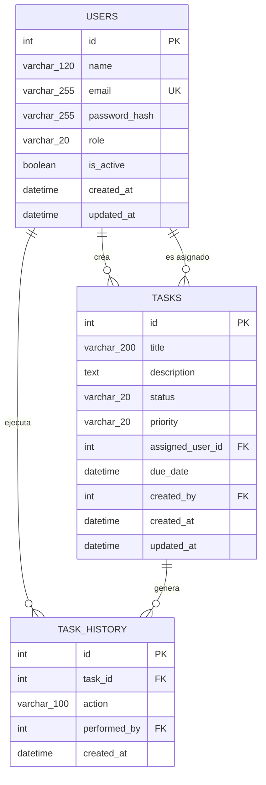

# Arquitectura de Base de Datos y Diagrama Entidad-Relación

## 1. Descripción general

El backend de **Marquillas Task Manager** utiliza una base de datos relacional **Microsoft SQL Server**, administrada mediante:

* SQLAlchemy ORM.
* Alembic para migraciones.
* FastAPI como capa de exposición de servicios.
* PyODBC como controlador de conexión con SQL Server.

El modelo de datos está orientado a la gestión de tareas, asignación de responsables, autenticación de usuarios y trazabilidad de eventos operativos.

Las entidades físicas actuales son:

* `users`
* `tasks`
* `task_history`

Este documento representa exclusivamente la estructura física definida por las migraciones de Alembic y los modelos SQLAlchemy vigentes.

---

## 2. Diagrama entidad-relación



---

## 3. Entidad `users`

La tabla `users` almacena los usuarios autorizados para acceder a la aplicación.

También representa a los usuarios que pueden:

* Crear tareas.
* Ser responsables de tareas.
* Ejecutar acciones que generan registros de auditoría.

### 3.1 Estructura

| Columna           | Tipo SQL              | Nulo | Clave | Valor predeterminado | Descripción                                                    |
| ----------------- | --------------------- | ---: | ----- | -------------------- | --------------------------------------------------------------- |
| `id`            | `INT`               |   No | PK    | Autoincremental      | Identificador único del usuario.                               |
| `name`          | `VARCHAR(120)`      |   No | —    | —                   | Nombre visible del usuario.                                     |
| `email`         | `VARCHAR(255)`      |   No | UK    | —                   | Correo electrónico único utilizado para autenticación.       |
| `password_hash` | `VARCHAR(255)`      |   No | —    | —                   | Hash criptográfico de la contraseña.                          |
| `role`          | `VARCHAR(20)`       |   No | —    | —                   | Rol de autorización del usuario.                               |
| `is_active`     | `BOOLEAN` / `BIT` |   No | —    | `1`                | Indica si el usuario puede autenticarse y operar en el sistema. |
| `created_at`    | `DATETIME`          |   No | —    | `SYSUTCDATETIME()` | Fecha y hora UTC de creación.                                  |
| `updated_at`    | `DATETIME`          |   No | —    | `SYSUTCDATETIME()` | Fecha y hora UTC de la última actualización.                  |

### 3.2 Restricciones

#### Clave primaria

```text
users.id
```

#### Restricción de unicidad

```text
users.email
```

Cada correo electrónico puede pertenecer únicamente a un usuario.

#### Restricción de rol

```sql
CHECK (role IN ('admin', 'member'))
```

Nombre de la restricción:

```text
ck_users_role
```

### 3.3 Roles soportados

| Rol        | Descripción                                 |
| ---------- | -------------------------------------------- |
| `admin`  | Usuario con privilegios administrativos.     |
| `member` | Usuario operativo con permisos restringidos. |

### 3.4 Consideraciones de seguridad

Las contraseñas no se almacenan en texto plano.

La tabla conserva únicamente:

```text
password_hash
```

La autenticación valida la contraseña proporcionada contra el hash almacenado.

Los usuarios con:

```text
is_active = 0
```

no pueden autenticarse ni utilizar endpoints protegidos.

---

## 4. Entidad `tasks`

La tabla `tasks` representa el estado operacional actual de cada tarea.

Almacena:

* Datos descriptivos.
* Estado.
* Prioridad.
* Responsable asignado.
* Usuario creador.
* Fecha límite.
* Marcas temporales.

### 4.1 Estructura

| Columna              | Tipo SQL         | Nulo | Clave | Valor predeterminado | Descripción                                  |
| -------------------- | ---------------- | ---: | ----- | -------------------- | --------------------------------------------- |
| `id`               | `INT`          |   No | PK    | Autoincremental      | Identificador único de la tarea.             |
| `title`            | `VARCHAR(200)` |   No | —    | —                   | Título de la tarea.                          |
| `description`      | `TEXT`         |  Sí | —    | `NULL`             | Descripción detallada de la tarea.           |
| `status`           | `VARCHAR(20)`  |   No | —    | `'pending'`        | Estado operacional actual.                    |
| `priority`         | `VARCHAR(20)`  |   No | —    | `'medium'`         | Prioridad de ejecución.                      |
| `assigned_user_id` | `INT`          |  Sí | FK    | `NULL`             | Usuario responsable de la tarea.              |
| `due_date`         | `DATETIME`     |  Sí | —    | `NULL`             | Fecha y hora límite de cumplimiento.         |
| `created_by`       | `INT`          |  Sí | FK    | `NULL`             | Usuario que creó la tarea.                   |
| `created_at`       | `DATETIME`     |   No | —    | `SYSUTCDATETIME()` | Fecha y hora UTC de creación.                |
| `updated_at`       | `DATETIME`     |   No | —    | `SYSUTCDATETIME()` | Fecha y hora UTC de la última modificación. |

### 4.2 Restricciones

#### Clave primaria

```text
tasks.id
```

#### Estados permitidos

```sql
CHECK (
    status IN (
        'pending',
        'in_progress',
        'completed',
        'cancelled'
    )
)
```

Nombre de la restricción:

```text
ck_tasks_status
```

#### Prioridades permitidas

```sql
CHECK (
    priority IN (
        'low',
        'medium',
        'high',
        'critical'
    )
)
```

Nombre de la restricción:

```text
ck_tasks_priority
```

### 4.3 Estados soportados

| Estado          | Descripción                            |
| --------------- | --------------------------------------- |
| `pending`     | La tarea está pendiente de ejecución. |
| `in_progress` | La tarea se encuentra en ejecución.    |
| `completed`   | La tarea fue finalizada.                |
| `cancelled`   | La tarea fue cancelada.                 |

### 4.4 Prioridades soportadas

| Prioridad    | Descripción                            |
| ------------ | --------------------------------------- |
| `low`      | Prioridad baja.                         |
| `medium`   | Prioridad media y valor predeterminado. |
| `high`     | Prioridad alta.                         |
| `critical` | Prioridad crítica.                     |

---

## 5. Entidad `task_history`

La tabla `task_history` almacena eventos asociados a las tareas.

Su objetivo es conservar un registro independiente de la tabla operacional `tasks`.

### 5.1 Estructura

| Columna          | Tipo SQL         | Nulo | Clave | Valor predeterminado | Descripción                                  |
| ---------------- | ---------------- | ---: | ----- | -------------------- | --------------------------------------------- |
| `id`           | `INT`          |   No | PK    | Autoincremental      | Identificador único del evento.              |
| `task_id`      | `INT`          |   No | FK    | —                   | Tarea relacionada con el evento.              |
| `action`       | `VARCHAR(100)` |   No | —    | —                   | Acción o descripción del evento registrado. |
| `performed_by` | `INT`          |   No | FK    | —                   | Usuario que ejecutó la acción.              |
| `created_at`   | `DATETIME`     |   No | —    | `SYSUTCDATETIME()` | Fecha y hora UTC del evento.                  |

### 5.2 Alcance actual de la auditoría

La implementación física actual registra:

* La tarea afectada.
* La acción realizada.
* El usuario que ejecutó la acción.
* La fecha y hora del evento.

La tabla física actual no contiene las columnas:

```text
field_name
previous_value
new_value
event_type
metadata
```

Estos campos aparecen en el esquema de respuesta de la aplicación como parte de una representación enriquecida, pero no forman parte de las migraciones ni del modelo SQLAlchemy actual.

Por tanto, la auditoría vigente debe considerarse una auditoría basada en eventos y no todavía una auditoría completa campo por campo.

---

## 6. Relaciones

## 6.1 Usuario creador de una tarea

Un usuario puede crear cero o muchas tareas.

Una tarea puede tener cero o un usuario creador, debido a que `created_by` actualmente admite `NULL`.

```text
users.id
    1
    │
    └──────────< 0..N
              tasks.created_by
```

Clave foránea:

```text
tasks.created_by
    →
users.id
```

Nombre explícito de la restricción creada por Alembic:

```text
fk_tasks_created_by_users
```

Cardinalidad:

```text
USERS 1 : N TASKS
```

Participación desde `tasks`:

```text
0..1 usuario creador por tarea
```

---

## 6.2 Usuario asignado a una tarea

Un usuario puede estar asignado a cero o muchas tareas.

Una tarea puede estar sin responsable o estar asignada a un único usuario.

```text
users.id
    1
    │
    └──────────< 0..N
              tasks.assigned_user_id
```

Clave foránea:

```text
tasks.assigned_user_id
    →
users.id
```

Cardinalidad:

```text
USERS 1 : N TASKS
```

Participación desde `tasks`:

```text
0..1 usuario asignado por tarea
```

La nulabilidad permite representar tareas todavía no asignadas.

---

## 6.3 Historial asociado a una tarea

Una tarea puede generar cero o múltiples eventos de historial.

Cada registro de historial pertenece obligatoriamente a una sola tarea.

```text
tasks.id
    1
    │
    └──────────< 0..N
              task_history.task_id
```

Clave foránea:

```text
task_history.task_id
    →
tasks.id
```

Cardinalidad:

```text
TASKS 1 : N TASK_HISTORY
```

Participación desde `task_history`:

```text
1 tarea obligatoria por registro
```

---

## 6.4 Usuario que ejecuta una acción

Un usuario puede ejecutar cero o múltiples acciones registradas en el historial.

Cada registro de historial debe estar asociado obligatoriamente a un usuario.

```text
users.id
    1
    │
    └──────────< 0..N
              task_history.performed_by
```

Clave foránea:

```text
task_history.performed_by
    →
users.id
```

Cardinalidad:

```text
USERS 1 : N TASK_HISTORY
```

Participación desde `task_history`:

```text
1 usuario obligatorio por registro
```

---

## 7. Resumen de cardinalidades

| Entidad origen | Relación     | Entidad destino  | Cardinalidad |
| -------------- | ------------- | ---------------- | ------------ |
| `users`      | Crea          | `tasks`        | 1:N          |
| `users`      | Es asignado a | `tasks`        | 1:N          |
| `tasks`      | Genera        | `task_history` | 1:N          |
| `users`      | Ejecuta       | `task_history` | 1:N          |

---

## 8. Claves primarias

| Tabla            | Columna | Tipo    | Estrategia      |
| ---------------- | ------- | ------- | --------------- |
| `users`        | `id`  | `INT` | Autoincremental |
| `tasks`        | `id`  | `INT` | Autoincremental |
| `task_history` | `id`  | `INT` | Autoincremental |

Las claves primarias son identificadores sustitutos de tipo entero.

---

## 9. Claves foráneas

| Tabla origen     | Columna              | Tabla destino | Columna destino | Nulable |
| ---------------- | -------------------- | ------------- | --------------- | ------: |
| `tasks`        | `assigned_user_id` | `users`     | `id`          |     Sí |
| `tasks`        | `created_by`       | `users`     | `id`          |     Sí |
| `task_history` | `task_id`          | `tasks`     | `id`          |      No |
| `task_history` | `performed_by`     | `users`     | `id`          |      No |

---

## 10. Índices

La migración `002_task_domain_foundation` crea índices para los campos utilizados en filtros, asignaciones, vencimientos y consultas de historial.

| Índice                          | Tabla            | Columna              | Propósito                                        |
| -------------------------------- | ---------------- | -------------------- | ------------------------------------------------- |
| `ix_tasks_status`              | `tasks`        | `status`           | Optimizar filtros y conteos por estado.           |
| `ix_tasks_priority`            | `tasks`        | `priority`         | Optimizar filtros y conteos por prioridad.        |
| `ix_tasks_assigned_user_id`    | `tasks`        | `assigned_user_id` | Optimizar consultas por responsable.              |
| `ix_tasks_due_date`            | `tasks`        | `due_date`         | Optimizar búsquedas y cálculos de vencimiento.  |
| `ix_task_history_task_id`      | `task_history` | `task_id`          | Optimizar la consulta del historial de una tarea. |
| `ix_task_history_performed_by` | `task_history` | `performed_by`     | Optimizar consultas por usuario ejecutor.         |

La restricción única de `users.email` también permite una búsqueda eficiente por correo electrónico.

---

## 11. Restricciones de integridad

### 11.1 Integridad de entidad

Cada tabla utiliza una clave primaria autoincremental:

```text
id
```

Esto garantiza que cada registro pueda identificarse de manera única.

### 11.2 Integridad referencial

Las relaciones se implementan mediante claves foráneas.

La base de datos impide registrar:

* Un `assigned_user_id` que no exista en `users`.
* Un `created_by` que no exista en `users`.
* Un `task_id` que no exista en `tasks`.
* Un `performed_by` que no exista en `users`.

### 11.3 Integridad de dominio

Los valores válidos de `role`, `status` y `priority` están limitados mediante restricciones `CHECK`.

Esto impide almacenar valores fuera de los dominios definidos por la aplicación.

### 11.4 Integridad de unicidad

El campo:

```text
users.email
```

es único.

No pueden existir dos usuarios con el mismo correo electrónico.

---

## 12. Valores predeterminados

| Tabla            | Columna        | Valor predeterminado |
| ---------------- | -------------- | -------------------- |
| `users`        | `is_active`  | `1`                |
| `users`        | `created_at` | `SYSUTCDATETIME()` |
| `users`        | `updated_at` | `SYSUTCDATETIME()` |
| `tasks`        | `status`     | `'pending'`        |
| `tasks`        | `priority`   | `'medium'`         |
| `tasks`        | `created_at` | `SYSUTCDATETIME()` |
| `tasks`        | `updated_at` | `SYSUTCDATETIME()` |
| `task_history` | `created_at` | `SYSUTCDATETIME()` |

Las fechas se generan utilizando tiempo UTC del servidor SQL Server.

---

## 13. Normalización

El esquema está diseñado siguiendo los principios de la Tercera Forma Normal, 3FN.

### Primera Forma Normal

Cada columna contiene valores atómicos.

No existen:

* Grupos repetidos.
* Listas embebidas.
* Columnas multivaluadas.

### Segunda Forma Normal

Todas las tablas utilizan claves primarias simples.

Los atributos no clave dependen completamente de la clave primaria de su tabla.

### Tercera Forma Normal

Los atributos no clave no dependen transitivamente de otros atributos no clave.

Ejemplos:

* Los datos del usuario no se duplican dentro de `tasks`.
* La tarea conserva únicamente los identificadores `assigned_user_id` y `created_by`.
* Los datos del usuario responsable se obtienen mediante relaciones.
* El historial se almacena en una tabla independiente.
* Los eventos históricos no se mezclan con el estado operacional actual de la tarea.

---

## 14. Estrategia de auditoría

La tabla `tasks` representa exclusivamente el estado actual de una tarea.

La tabla `task_history` representa eventos históricos asociados a dicha tarea.

Esta separación permite:

* Mantener la tabla `tasks` enfocada en operaciones CRUD.
* Consultar el historial sin duplicar el estado actual.
* Relacionar cada evento con el usuario autenticado.
* Registrar eventos sin modificar la estructura central de la tarea.
* Extender la auditoría posteriormente mediante nuevas migraciones.

La implementación actual registra una descripción de la acción en:

```text
task_history.action
```

y el usuario responsable en:

```text
task_history.performed_by
```

No debe afirmarse que la base de datos almacena actualmente diferencias campo por campo, porque no existen columnas físicas para:

```text
field_name
previous_value
new_value
```

---

## 15. Campos calculados y campos de respuesta

Algunos campos definidos en los esquemas Pydantic no son columnas de base de datos.

Entre ellos se encuentran:

```text
assigned_user_name
assigned_user_email
is_overdue
days_overdue
user_name
user_email
event_type
metadata
```

Estos datos son:

* Calculados por la capa de servicio.
* Derivados de relaciones.
* Enriquecidos durante la serialización.
* Construidos para la respuesta de la API.

No deben incorporarse al diagrama físico de la base de datos.

---

## 16. Decisiones de diseño

### 16.1 Identificadores enteros

Se utilizan identificadores enteros autoincrementales por simplicidad, rendimiento y compatibilidad con SQL Server.

### 16.2 Asignación opcional

`tasks.assigned_user_id` acepta `NULL` para permitir la creación de tareas sin responsable inicial.

### 16.3 Creador opcional

`tasks.created_by` acepta `NULL` debido a que fue incorporado mediante una migración posterior sobre una tabla existente.

Esto permite compatibilidad con registros previos a la migración.

### 16.4 Historial separado

Los eventos se almacenan fuera de `tasks` para evitar:

* Sobrecargar la entidad operacional.
* Duplicar información.
* Mezclar estado actual con historial.
* Dificultar consultas de auditoría.

### 16.5 Marcas temporales UTC

La base de datos utiliza:

```sql
SYSUTCDATETIME()
```

para reducir inconsistencias entre zonas horarias.

### 16.6 Restricciones en la base de datos

Las reglas críticas no dependen únicamente de FastAPI o Pydantic.

También se aplican mediante:

* Claves foráneas.
* Restricciones únicas.
* Restricciones `CHECK`.
* Columnas no nulas.
* Valores predeterminados.

Esto proporciona defensa en profundidad para la integridad de datos.

---

## 17. Consideraciones de rendimiento

Los índices actuales están orientados a las operaciones principales del sistema:

* Filtrar tareas por estado.
* Filtrar tareas por prioridad.
* Consultar tareas asignadas a un usuario.
* Consultar tareas por fecha de vencimiento.
* Recuperar el historial de una tarea.
* Consultar acciones ejecutadas por un usuario.

Los índices deben revisarse a medida que aumente el volumen de datos.

Posibles mejoras futuras, sujetas a métricas reales, incluyen:

* Índices compuestos para filtros combinados.
* Índice compuesto por `status` y `priority`.
* Índice compuesto por `assigned_user_id` y `status`.
* Índice compuesto por `task_id` y `created_at`.
* Índices para ordenamiento frecuente.
* Estrategias de archivado del historial.

Estas mejoras no forman parte del esquema actual.

---

## 18. Migraciones

La estructura actual se construye mediante dos revisiones de Alembic.

### Migración inicial

```text
001_initial_schema
```

Crea:

* `users`
* `tasks`
* `task_history`
* Claves primarias.
* Claves foráneas iniciales.
* Restricciones de dominio.
* Restricción única de correo.
* Valores predeterminados.

### Migración del dominio de tareas

```text
002_task_domain_foundation
```

Agrega:

* `tasks.due_date`
* `tasks.created_by`
* Relación entre `tasks.created_by` y `users.id`
* Índices operacionales.
* Índices de historial.

Dependencia:

```text
002_task_domain_foundation
    →
001_initial_schema
```

---

## 19. Extensiones futuras

Las siguientes extensiones son posibilidades de evolución y no forman parte de la base de datos actual:

* Comentarios de tareas.
* Archivos adjuntos.
* Etiquetas.
* Proyectos.
* Equipos.
* Notificaciones.
* Seguidores de tareas.
* Actividad del usuario.
* Resúmenes generados mediante inteligencia artificial.
* Auditoría detallada por campo.
* Metadatos estructurados de eventos.
* Sesiones persistentes.
* Tokens de actualización.
* Revocación de sesiones.

Estas funcionalidades deberían incorporarse mediante nuevas tablas y migraciones incrementales, sin modificar retrospectivamente las migraciones ya aplicadas.

---

## 20. Posible evolución de la auditoría

Una futura migración podría ampliar `task_history` con campos como:

```text
field_name
previous_value
new_value
event_type
event_metadata
```

Esto permitiría una auditoría detallada por atributo.

Dicha evolución debe implementarse mediante una nueva revisión de Alembic, por ejemplo:

```text
003_task_history_detail
```

Hasta que esa migración exista, estos campos no deben presentarse como parte del modelo físico actual.

---

## 21. Resumen del modelo

| Tabla            | Responsabilidad                                            |
| ---------------- | ---------------------------------------------------------- |
| `users`        | Identidad, autenticación, roles y estado de los usuarios. |
| `tasks`        | Estado operacional actual de las tareas.                   |
| `task_history` | Registro cronológico de eventos asociados a tareas.       |

El modelo separa correctamente:

* Identidad.
* Operación.
* Asignación.
* Auditoría.
* Seguridad.
* Trazabilidad.

La estructura actual es coherente con una aplicación de gestión de tareas de alcance técnico y permite evolucionar mediante migraciones controladas sin romper las entidades principales.
