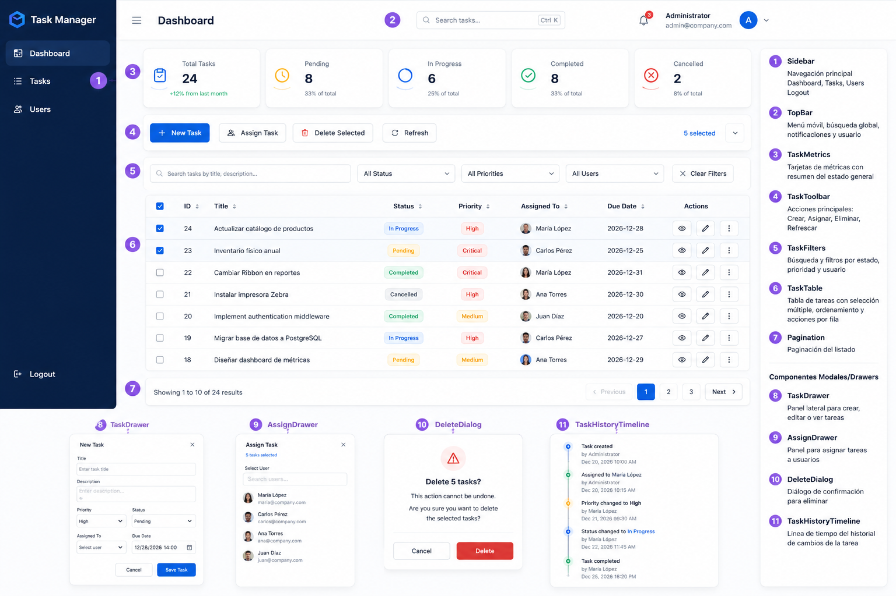

@'

# Marquillas Task Manager

Prueba técnica full-stack para gestión de tareas de equipo.

## Estado actual

Día 00 — Fundación del repositorio y entorno reproducible.

## Stack previsto

- React con Vite
- FastAPI
- SQLAlchemy
- Alembic
- SQL Server
- Docker Compose
- JWT
- Integración LLM

## Arquitectura

Aplicación cliente-servidor de tres capas con MVC distribuido:

- Vista: React SPA.
- Controlador: FastAPI REST.
- Modelo: servicios, repositorios, SQLAlchemy y SQL Server.

## Repositorio

El desarrollo se realizará mediante ramas feature y pull requests hacia `development`.
'@ | Set-Content README.md

# AGENTE IA

## Prompt Injection

El sistema utiliza un prompt de sistema almacenado en `backend/app/modules/ai/prompts/enrich_task_system.txt`, evitando instrucciones embebidas en el código fuente. Las entradas del usuario se limitan al título y descripción de la tarea y la respuesta se valida mediante un esquema Pydantic utilizando Structured Outputs. No se ejecutan instrucciones provenientes del contenido suministrado por el usuario.

## Costos

La integración utiliza un modelo configurable mediante variables de entorno, permitiendo ajustar el equilibrio entre costo y rendimiento sin modificar el código. Cada solicitud realiza una única llamada al modelo y devuelve únicamente la información requerida por el esquema de respuesta, reduciendo el consumo de tokens y facilitando el control de costos operativos.
